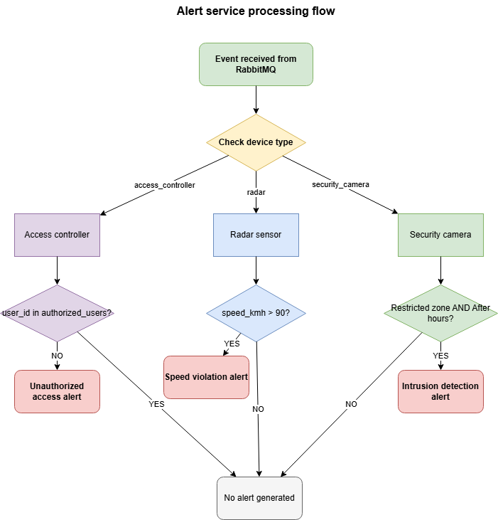

# IoT Event Ingestion and Alerting System

System that ingests IoT events, processes them, and generates alerts based on predefined criteria.

## Quick start

```bash
# Clone the repository
git clone https://github.com/dzaja123/event-ingestion-and-alerting-system.git
cd event-ingestion-and-alerting-system

# Configure environment
cp .env.example .env

# Start all services
docker-compose up --build -d

# Verify services are running
docker-compose ps
```

**Access points:**
- Ingestion API: http://localhost:8000/docs
- Alerting API: http://localhost:8001/docs  
- RabbitMQ Management: http://localhost:15672 (guest/guest)

## Architecture


*Figure 1: IoT event ingestion and alerting system architecture*

Two microservices communicate via RabbitMQ:
- **Ingestion service** (port 8000): Event validation, storage, and publishing
- **Alerting service** (port 8001): Event processing and alert generation

**Tech stack:** FastAPI, PostgreSQL, Redis, RabbitMQ, Docker

**Data flow:**
1. Sensors must be registered first via POST /api/v1/sensors
2. IoT devices send events to Ingestion Service REST API
3. Ingestion Service validates device_id against cached sensor data
4. Events from unregistered device_ids are rejected
5. Valid events are stored in PostgreSQL and published to RabbitMQ
6. Alerting Service consumes events and generates alerts when criteria are met
7. Alerts are stored in PostgreSQL and retrieved via REST API

## Database schema


*Figure 2: Database schema and relationships*

## Alert processing



*Figure 3: Alert service processing flow*

## Data validation

**Validation rules:**
- device_id must be valid MAC address format (e.g., AA:BB:CC:DD:EE:FF)
- Only registered sensors can submit events
- Unregistered sensors are rejected with 403 Forbidden

**Caching strategy:**
- Sensor details cached in Redis for fast device_id validation
- Authorized users list cached in Redis for quick access control checks
- Cache TTL: 1 hour for sensor details, 1 hour for authorized users

## Alert criteria

### 1. Unauthorized access
**Trigger:** Access control event with `user_id` not in authorized list

**Triggers alert:**
```json
{
  "device_id": "AA:BB:CC:DD:EE:FF",
  "event_type": "access_attempt", 
  "user_id": "unauthorized_user"
}
```

**Does not trigger alert:**
```json
{
  "device_id": "AA:BB:CC:DD:EE:FF",
  "event_type": "access_attempt", 
  "user_id": "authorized_user"
}
```

### 2. Speed violation  
**Trigger:** Radar event with `speed_kmh` > 90

**Triggers alert:**
```json
{
  "device_id": "11:22:33:44:55:66",
  "event_type": "speed_violation",
  "speed_kmh": 120,
  "location": "Zone A"
}
```

**Does not trigger alert:**
```json
{
  "device_id": "11:22:33:44:55:66",
  "event_type": "speed_violation",
  "speed_kmh": 70,
  "location": "Zone A"
}
```

### 3. Intrusion detection
**Trigger:** Motion in restricted area during after-hours (18:00-05:59)
- **Restricted zones:** "Restricted Area", "Secure Zone", "Private Area", "Classified Zone"

**Triggers alert:**
```json
{
  "device_id": "77:88:99:AA:BB:CC", 
  "timestamp": "2024-12-18T22:00:00Z",
  "event_type": "motion_detected",
  "zone": "Restricted Area",
  "confidence": 0.95,
  "photo_base64": "<base64-string>"
}
```

**Does not trigger alert:**
```json
{
  "device_id": "77:88:99:AA:BB:CC",
  "timestamp": "2024-12-18T14:00:00Z",
  "event_type": "motion_detected",
  "zone": "Open Area",
  "confidence": 0.80,
  "photo_base64": "<base64-string>"
}
```

## API endpoints

### Ingestion service (port 8000)
- `POST /api/v1/sensors` - Register sensor
- `GET /api/v1/sensors` - List sensors
- `POST /api/v1/events` - Submit events
- `GET /api/v1/events` - Retrieve events with filters

### Alerting service (port 8001)
- `GET /api/v1/alerts` - Retrieve alerts with filters
- `GET /api/v1/alerts/{id}` - Get specific alert
- `POST /api/v1/authorized-users` - Add authorized user
- `GET /api/v1/authorized-users` - List authorized users
- `DELETE /api/v1/authorized-users/{user_id}` - Remove authorized user

Full API documentation available at `/docs` endpoints.

## Testing

### Unit tests
```bash
# Ingestion service
docker-compose exec ingestion_service python -m pytest tests/ --asyncio-mode=auto -v

# Alerting service
docker-compose exec alerting_service python -m pytest tests/ --asyncio-mode=auto -v
```

### End-to-end tests
```bash
cd e2e

python -m venv .venv

# Windows
.venv\Scripts\activate

# macOS/Linux
source .venv/bin/activate

pip install -r requirements.txt

python run_tests.py
```

## Configuration

Copy `.env.example` to `.env` and modify as needed.

## Health monitoring

Both services provide health check endpoints at `GET /health` with dependency status:

```json
{
  "status": "healthy|degraded|unhealthy",
  "service": "ingestion_service|alerting_service", 
  "dependencies": {
    "database": "healthy",
    "redis": "healthy",
    "rabbitmq": "healthy"
  }
}
```